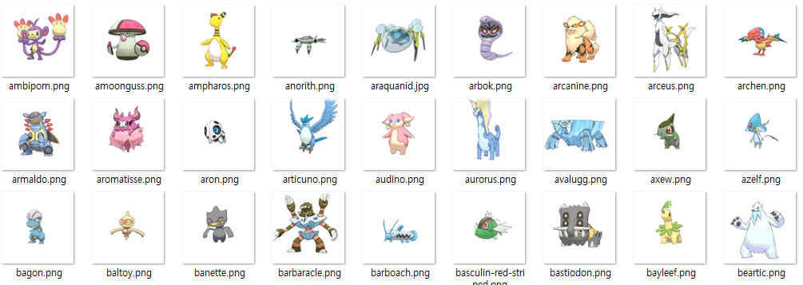
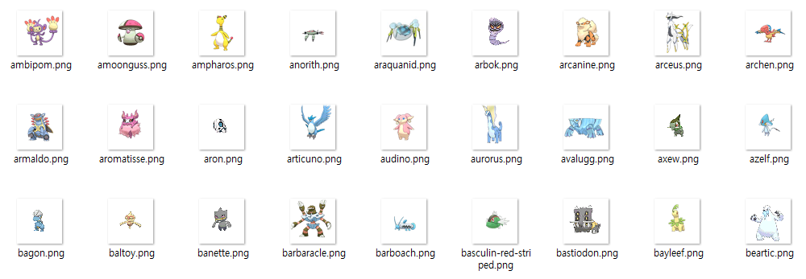
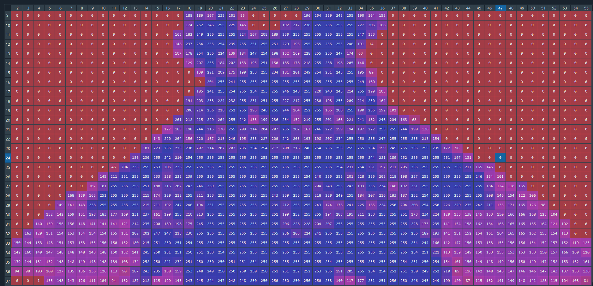
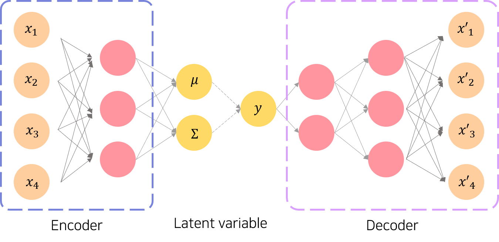
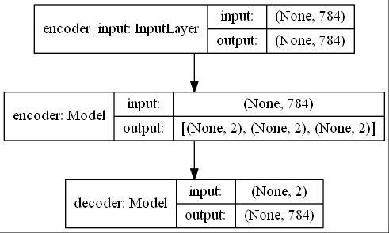
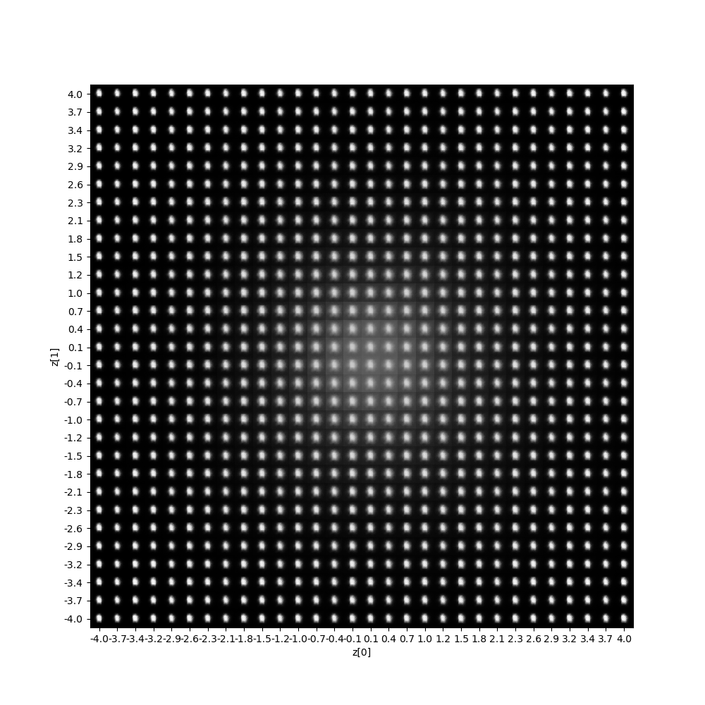
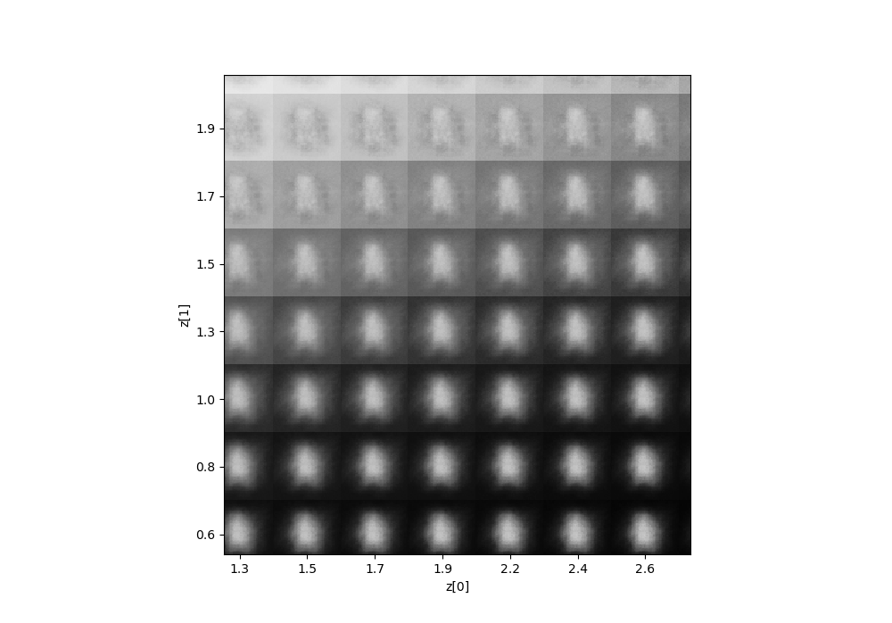
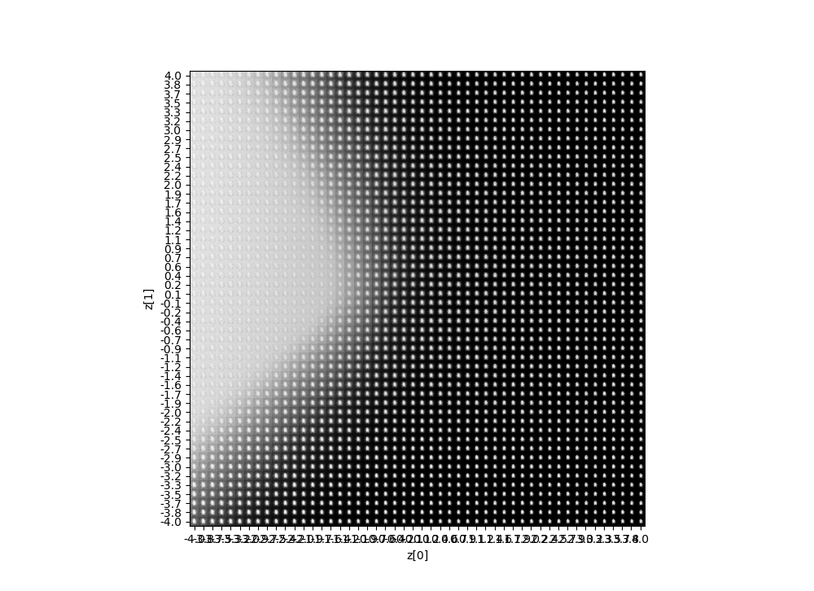
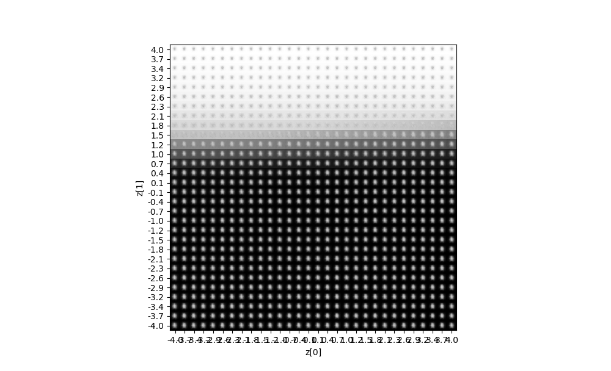

# Requirements

- Tensorflow
- Keras
- Graphviz [https://www.graphviz.org/]
```python
conda install graphviz
# Or install manually (Check https://www.graphviz.org/)
```


# Pokemon-AutoEncoder
VAE base Pokemon-AutoEncoder Project

VAE를 활용한 포켓몬데이터에 대한 VAE를 통한 Generating 프로젝트입니다.

전처리와 VAE모델 파일로 구성되어 있습니다. 

# Preprocessing
## Origianl data set


※    In Images folder 120x120 Pokemon Image files [809pokemons data]

## Images Resized and Regular image formated(PNG) data set

※    In Preprocessed folder 56x56 Pokemon Image files [809pokemons data]

## Images npy matrix(.npy) data set

※    In MatrixPreprocessed folder 56x56 Pokemon Image files [809pokemons data]


# Model
## VAE Model Overview
Adapt VAE Model



- Simple Structure



- Simple Structure


## VAE Model Result
  
  


